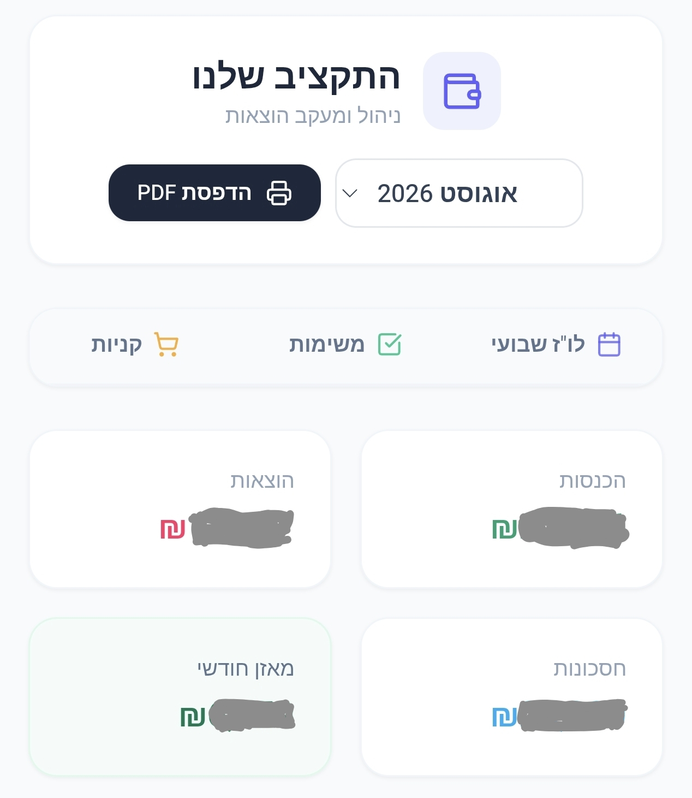
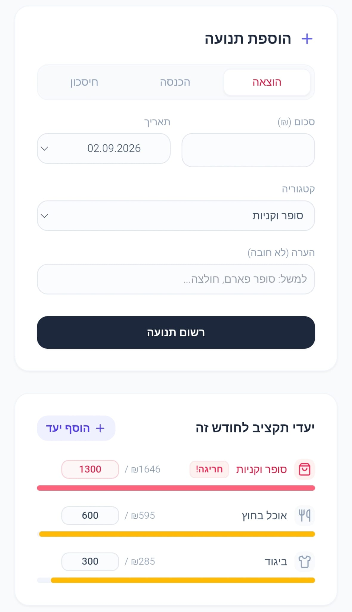
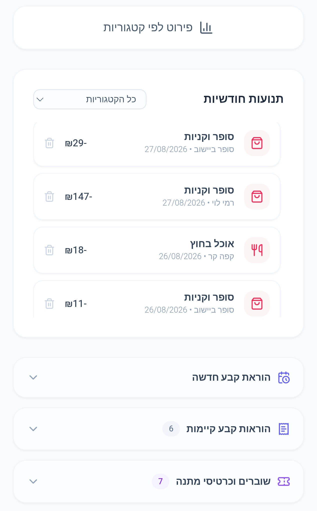

# Budget App

A comprehensive, full-stack web application designed for personal finance management, budgeting, and daily task organization.

## 🌟 Features

* **Financial Dashboard:** A central overview of your financial health, providing quick insights and summaries.
* **Transaction Management:** Track and categorize your income and expenses seamlessly.
* **Quick Tools:**
  * **Shopping List:** Manage your grocery and daily shopping needs.
  * **Task List:** Track your ongoing and pending tasks.
  * **Vouchers:** Store and organize your digital vouchers and coupons.
  * **Weekly Schedule:** Plan your week efficiently with an integrated planner.

## 🚀 Tech Stack

* **Frontend:** React, Tailwind CSS, Vite
* **Backend & Database:** Firebase (Firestore, Authentication)
* **Icons:** Lucide React
* **Deployment:** Vercel
* **Tooling:** ESLint, Git Hooks (Husky/Native hooks)

## 🛠️ Getting Started

### Prerequisites

* [Node.js](https://nodejs.org/) (v18 or higher recommended)
* npm, yarn, or pnpm

### Installation

1. **Clone the repository:**
   ```bash
   git clone [https://github.com/your-username/budget-app.git](https://github.com/your-username/budget-app.git)
   cd budget-app
Install dependencies:

Bash
npm install
Set up Environment Variables:
Create a local environment file based on the provided example.

Bash
cp .env.example .env.local
Open .env.local and fill in your Firebase configuration keys and any other required secrets.

Run the development server:

Bash
npm run dev
The application will be available at http://localhost:5173.

📦 Deployment
This project is optimized for deployment on Vercel.
Simply link the repository to your Vercel account, and it will automatically detect the Vite build settings (npm run build). Remember to add your .env.local variables to the Vercel project settings.

👨‍💻 Author
Gilad Abudi

## Screenshots

<p align="center">
  
  
  
</p>